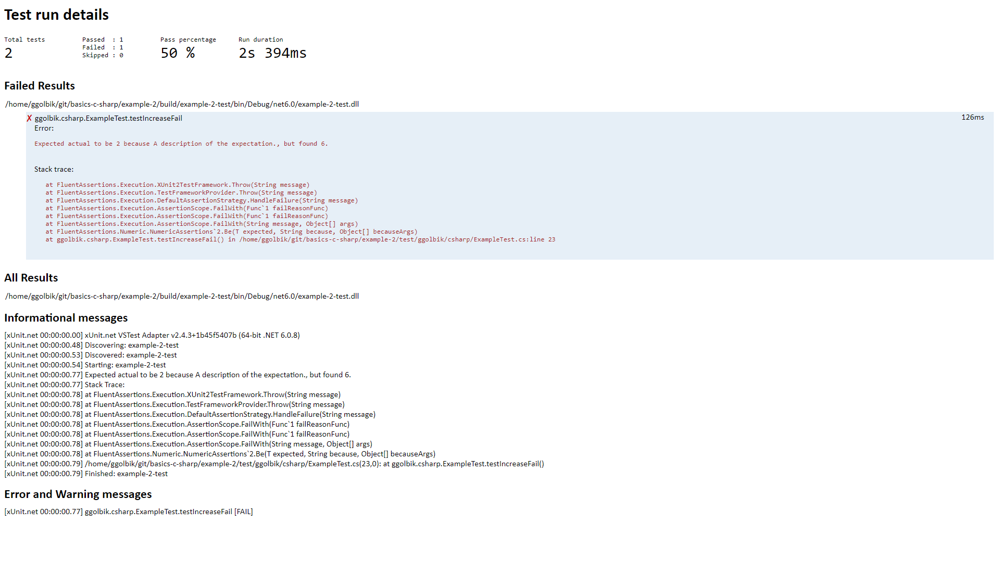
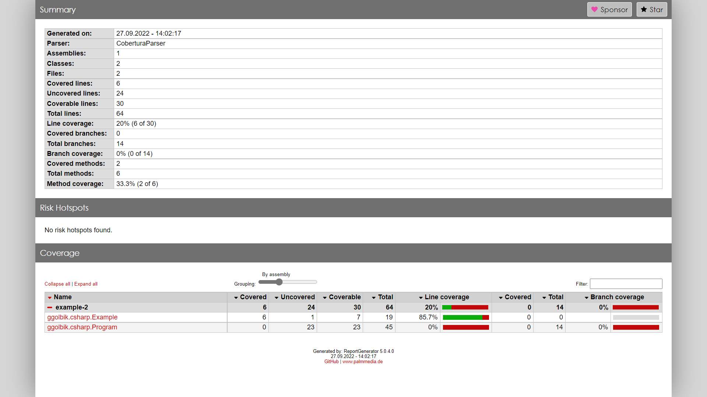

# 002-tests-and-code-coverage - Console application with unit tests and code coverage

# Table of Contents

* [Create](#create)
* [Project Settings](#project-settings)
* [AssemblyInfo](#assemblyinfo)
* [XUnit](#xunit)
* [Build](#build)
* [Tests](#tests)
  * [Test Result](#test-result)
  * [Test Coverage](#test-coverage)

# Create

Create a new console application project:
~~~
dotnet new console --framework net6.0 --name 002-tests-and-code-coverage --output ./src
~~~

Update `*.csproj` to
~~~xml
<Project Sdk="Microsoft.NET.Sdk">
  <PropertyGroup>
    <OutputType>Exe</OutputType>
    <TargetFramework>net6.0</TargetFramework>
    <RootNamespace>example_1</RootNamespace>
    <ImplicitUsings>enable</ImplicitUsings>
    <Nullable>enable</Nullable>
  </PropertyGroup>
</Project>
~~~

# Project Settings

Setting the [`MSBUildProjectExtensionsPath`](https://docs.microsoft.com/en-us/nuget/reference/msbuild-targets), `BaseOutputPath` (`bin`) and `BaseIntermediateOutputPath` (`obj`) properties in the [`Directory.Build.Props`](https://docs.microsoft.com/en-us/visualstudio/msbuild/customize-your-build?view=vs-2019) file, which is located in the root directory of your solution.
~~~xml
<Project>
  <PropertyGroup>
    <MSBUildProjectExtensionsPath>$(MSBuildProjectDirectory)\..\build\$(MSBuildProjectName)\obj\</MSBUildProjectExtensionsPath>
    <BaseOutputPath>$(MSBuildProjectDirectory)\..\build\$(MSBuildProjectName)\bin\</BaseOutputPath>
    <BaseIntermediateOutputPath>$(MSBuildProjectDirectory)\..\build\$(MSBuildProjectName)\obj\</BaseIntermediateOutputPath>
  </PropertyGroup>
</Project>
~~~

# AssemblyInfo

Either define your values in the `*.csproj` file (see [properties](https://docs.microsoft.com/en-us/nuget/reference/msbuild-targets))
~~~xml
<Project Sdk="Microsoft.NET.Sdk">

  <PropertyGroup>
    <Title>.Net Console Application</Title>
    <Version>1.0.0</Version>
    <AssemblyVersion>1.0.0.1</AssemblyVersion>
    <Authors>GGolbik</Authors>
    <Description>A simple dotnet console application.</Description>
  </PropertyGroup>

</Project>
~~~

or create an `AssemblyInfo.cs` with the below content.
~~~C#
using System.Reflection;

[assembly: AssemblyVersion("1.0.0.*")]
[assembly: AssemblyInformationalVersion("1.0.0")]
~~~

The `AssemblyInfo.cs` solution requires that `GenerateAssemblyInfo` is `false` in the `*.csproj` file
~~~xml
<Project Sdk="Microsoft.NET.Sdk">
  <PropertyGroup>
    <GenerateAssemblyInfo>false</GenerateAssemblyInfo>
  </PropertyGroup>
</Project>
~~~

If you like to use a wildcard in your version number you must add the `Deterministic` entry or you will get the error: `Wildcards are only allowed if the build is not deterministic, which is the default for .Net Core projects. Adding False to csproj fixes the issue.`
~~~xml
<Project Sdk="Microsoft.NET.Sdk">
  <PropertyGroup>
    <Deterministic>false</Deterministic>
  </PropertyGroup>
</Project>
~~~

The values are accessible with
~~~C#
// AssemblyVersion
Console.WriteLine($"Version: {System.Reflection.Assembly.GetEntryAssembly()?.GetName().Version}");
// AssemblyFileVersion
Console.WriteLine($"FileVersion: {System.Reflection.Assembly.GetEntryAssembly()?.GetCustomAttribute<AssemblyFileVersionAttribute>()?.Version}");
// AssemblyInformationalVersion
Console.WriteLine($"InformationalVersion: {System.Reflection.Assembly.GetEntryAssembly()?.GetCustomAttribute<AssemblyInformationalVersionAttribute>()?.InformationalVersion}");
~~~

# XUnit

The xunit package brings in three child packages which include functionality that most developers want:
- xunit.core (the testing framework itself), 
- xunit.assert (the library which contains the Assert class), 
- and xunit.analyzers (which enables Roslyn analyzers to detect common issues with unit tests and xUnit.net extensibility).

The packages xunit.runner.visualstudio and Microsoft.NET.Test.Sdk are required for being able to run your test project inside Visual Studio as well as with dotnet test.

The coverlet.collector package allows collecting code coverage. If you don't intend to collect code coverage, you should remove this package reference.
~~~
dotnet new xunit --framework net6.0 --name 002-tests-and-code-coverage-test --output ./test
~~~

Add ReportGenerator and coverlet.msbuild for coverage.
~~~
dotnet add package coverlet.msbuild --version 3.1.2
dotnet add package ReportGenerator --version 5.0.4
~~~

~~~
dotnet add package FluentAssertions
~~~

The test result can be found in `build/test/result.html`. The coverage report can be found in `build/test/coverage/index.htm`.

# Build

You can build the project with the `build.sh` or with the `build-docker.sh` script. 

# Tests

You can execute the test by running the `test.sh` script.
The build scripts will execute the tests as well. The test output is available in the `build/test` directory.

The test can also be executed in VSCode with the [.NET Core Test Explorer](https://marketplace.visualstudio.com/items?itemName=formulahendry.dotnet-test-explorer) extension.

## Test Result

The test result can be found in `build/test/result.html`. 

## Test Coverage

The coverage report can be found in `build/test/coverage/index.htm`.

