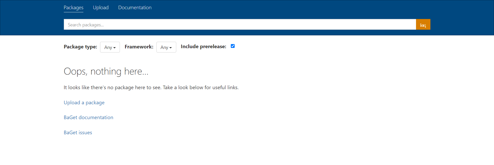
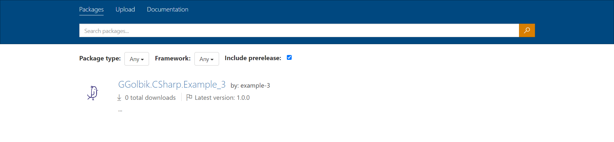
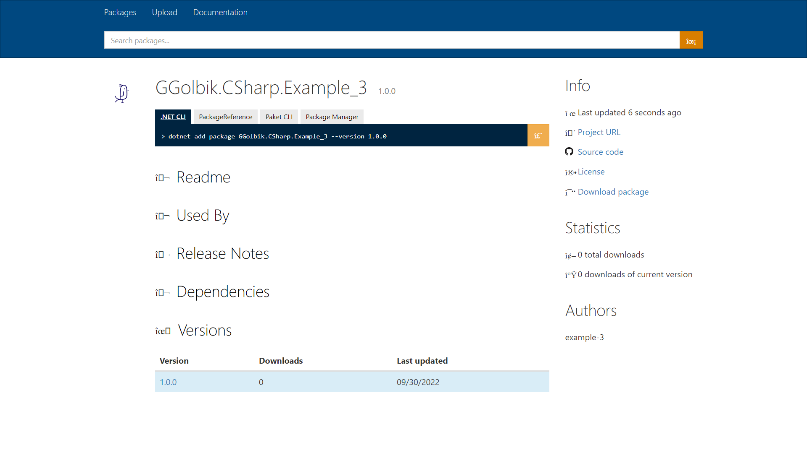

# Example 3 - Library as NuGet package

# Table of Contents

* [Create](#create)
* [Project Settings](#project-settings)
* [AssemblyInfo](#assemblyinfo)
  * [NuGet](#nuget)
* [Use in Project](#use-in-project)
* [Build](#build)
  * [Build NuGet](#build-nuget)
  * [Load NuGet Package](#local-package-directory)
  * [Publish NuGet Package](#publish-nuget-package)
    * [Local Package Directory](#local-package-directory)
  * [NuGet Server](#nuget-server)

# Create

Create a new console application project:
~~~
dotnet new classlib --framework net6.0 --name example-3 --output ./src
~~~

Change the value of `<OutputType>` to `Library` inside `*.csproj` or omit the property to produce a library:
~~~xml
<Project Sdk="Microsoft.NET.Sdk">
  <PropertyGroup>
    <OutputType>Library</OutputType>
    <TargetFramework>net6.0</TargetFramework>
    <RootNamespace>example_3</RootNamespace>
    <ImplicitUsings>enable</ImplicitUsings>
    <Nullable>enable</Nullable>
  </PropertyGroup>
</Project>
~~~

# Project Settings

Setting the [`MSBUildProjectExtensionsPath`](https://docs.microsoft.com/en-us/nuget/reference/msbuild-targets), `BaseOutputPath` (`bin`) and `BaseIntermediateOutputPath` (`obj`) properties in the [`Directory.Build.Props`](https://docs.microsoft.com/en-us/visualstudio/msbuild/customize-your-build?view=vs-2019) file, which is located in the root directory of your solution. The `PackageOutputPath` is necessary for the NuGet package.
~~~xml
<Project>
  <PropertyGroup>
    <MSBUildProjectExtensionsPath>$(MSBuildProjectDirectory)\..\build\$(MSBuildProjectName)\obj\</MSBUildProjectExtensionsPath>
    <BaseOutputPath>$(MSBuildProjectDirectory)\..\build\$(MSBuildProjectName)\bin\</BaseOutputPath>
    <BaseIntermediateOutputPath>$(MSBuildProjectDirectory)\..\build\$(MSBuildProjectName)\obj\</BaseIntermediateOutputPath>
    <PackageOutputPath>$(MSBuildProjectDirectory)\..\build\$(MSBuildProjectName)\</PackageOutputPath>
  </PropertyGroup>
</Project>
~~~

# AssemblyInfo

Either define your values in the `*.csproj` file (see [properties](https://docs.microsoft.com/en-us/nuget/reference/msbuild-targets))
~~~xml
<Project Sdk="Microsoft.NET.Sdk">

  <PropertyGroup>
    <Title>.Net Library</Title>
    <Version>1.0.0</Version>
    <AssemblyVersion>1.0.0.1</AssemblyVersion>
    <Authors>GGolbik</Authors>
    <Description>A simple dotnet library.</Description>
  </PropertyGroup>

</Project>
~~~

or create an `AssemblyInfo.cs` with the below content.
~~~C#
using System.Reflection;

[assembly: AssemblyVersion("1.0.0.*")]
[assembly: AssemblyInformationalVersion("1.0.0")]
~~~

The `AssemblyInfo.cs` solution requires that `GenerateAssemblyInfo` is `false` in the `*.csproj` file
~~~xml
<Project Sdk="Microsoft.NET.Sdk">
  <PropertyGroup>
    <GenerateAssemblyInfo>false</GenerateAssemblyInfo>
  </PropertyGroup>
</Project>
~~~

If you like to use a wildcard in your version number you must add the `Deterministic` entry or you will get the error: `Wildcards are only allowed if the build is not deterministic, which is the default for .Net Core projects. Adding False to csproj fixes the issue.`
~~~xml
<Project Sdk="Microsoft.NET.Sdk">
  <PropertyGroup>
    <Deterministic>false</Deterministic>
  </PropertyGroup>
</Project>
~~~

The values are accessible with
~~~C#
// AssemblyVersion
Console.WriteLine($"Version: {System.Reflection.Assembly.GetEntryAssembly()?.GetName().Version}");
// AssemblyFileVersion
Console.WriteLine($"FileVersion: {System.Reflection.Assembly.GetEntryAssembly()?.GetCustomAttribute<AssemblyFileVersionAttribute>()?.Version}");
// AssemblyInformationalVersion
Console.WriteLine($"InformationalVersion: {System.Reflection.Assembly.GetEntryAssembly()?.GetCustomAttribute<AssemblyInformationalVersionAttribute>()?.InformationalVersion}");
~~~

## NuGet

Every NuGet package has a manifest that describes the package's contents and dependencies. In the final NuGet package, the manifest is a `.nuspec` file, which uses the NuGet [metadata properties](https://learn.microsoft.com/en-us/nuget/reference/msbuild-targets#pack-target) you include in the project file.

The package identifier (`PackageId`) must be unique across nuget.org and other package sources. If not defined, this will be the `${AssemblyName}` which is the name of the `<name>.csproj` file by default. Therefore it's recommended to specify the value.

~~~xml
<PropertyGroup>
  <Version>1.0.0</Version>
  <FileVersion>1.0.0</FileVersion>
  <InformationalVersion>1.0.0</InformationalVersion>
  <Title>.Net Library</Title>
  <Description>...</Description>
  <Authors>GGolbik</Authors>
  <Company>GGolbik</Company>
  <Copyright>Copyright © GGolbik 2022</Copyright>
  <PackageId>GGolbik.CSharp.Example_3</PackageId>
  <PackageLicenseExpression>MIT</PackageLicenseExpression>
  <PackageProjectUrl>https://github.com/GGolbik/basics-c-sharp</PackageProjectUrl>
  <!-- Image file size is limited to 1 MB. Supported file formats include JPEG and PNG. We recommend an image resolution of 128x128. -->
  <PackageIcon>../logo_small_icon_only.png</PackageIcon>
  <PackageReadmeFile>../README.md</PackageReadmeFile>
  <!-- This will just be a simple text file -->
  <PackageReleaseNotes>$([System.IO.File]::ReadAllText("$(MSBuildProjectDirectory)/../CHANGELOG.md"))</PackageReleaseNotes>
  <RepositoryUrl>https://github.com/GGolbik/basics-c-sharp.git</RepositoryUrl>
  <RepositoryType>git</RepositoryType>
</PropertyGroup>
~~~

# Use in Project

Add the `ProjectReference` to the `*.csproj` file of the project which depends on the library e.g.:

~~~xml
  <ItemGroup>
    <ProjectReference Include="..\..\example-3\src\example-3.csproj" />
  </ItemGroup>
~~~

# Build

You can build the project with the `build.sh` or with the `build-docker.sh` script.

## Build NuGet

To build a NuGet package or .nupkg file from the project, run the dotnet pack command, which also builds the project automatically.
~~~
dotnet pack
~~~

To automatically run dotnet pack whenever you run dotnet build, add the following line to your project file within `<PropertyGroup>`:

~~~xml
<GeneratePackageOnBuild>true</GeneratePackageOnBuild>
~~~

## Load NuGet Package

We need to go into the target projects `.csproj` file. We want to test out our NuGet package on our console app called app so we open up app.csproj and under `PropertyGroup` we add a tag called `RestoreSources`. Here we point out both the path to our local NuGet package and the NuGet stream. It should look like so:
~~~xml
<RestoreSources>$(RestoreSources);absolute-path-to-my-solution/library/bin/Debug;https://api.nuget.org/v3/index.json</RestoreSources>
~~~

You need to replace absolute-path-to-my-solution/library/bin/Debug above with the absolute path to where your package is located.

Now that we pointed out where NuGet can find our package we are ready to install it.

~~~
dotnet add app package GGolbik.CSharp.Example_3
~~~

## Publish NuGet Package

- [Quickstart: Create and publish a package with the dotnet CLI](https://learn.microsoft.com/en-us/nuget/quickstart/create-and-publish-a-package-using-the-dotnet-cli#publish-the-package)

### Local Package Directory

Create directory for the local nuget packages. It's recommended to create the below directory structure but the packages can also be inserted at the top level directory.
~~~
./nuget
  └─<packageID>
    └─<version>
      ├─<packageID>.<version>.nupkg
      └─<other files>
~~~

Example:
~~~
./nuget
  └─GGolbik.CSharp.Example_3
    └─1.0.0
      └─GGolbik.CSharp.Example_3.1.0.0.nupkg
~~~

or
~~~
./nuget
  └─GGolbik.CSharp.Example_3.1.0.0.nupkg
~~~

Show current list:
~~~
dotnet nuget list source 
Registrierte Quellen:
  1.  nuget.org [Aktiviert]
      https://api.nuget.org/v3/index.json
~~~

[Add source](https://learn.microsoft.com/de-de/dotnet/core/tools/dotnet-nuget-add-source)
~~~
dotnet nuget add source $(pwd)/nuget --name local
~~~

Show updated list:
~~~
dotnet nuget list source 
Registrierte Quellen:
  1.  nuget.org [Aktiviert]
      https://api.nuget.org/v3/index.json
  2.  local [Aktiviert]
      <$(pwd)>/nuget
~~~

Add Package to a project
~~~
dotnet add package GGolbik.CSharp.Example_3 --version 1.0.0
~~~

If you repackage the app with the same version, you must remove the cached package (`dotnet nuget locals --list all` shows the path to the local cache):
~~~
rm -r ~/.nuget/packages/ggolbik.csharp.example_3/
~~~

Remove source
~~~
dotnet nuget remove source local
~~~

## NuGet Server

Run NuGet server [BaGet](https://github.com/loic-sharma/BaGet)
~~~
docker run --rm --name nuget-server -p 5555:80 loicsharma/baget
~~~

~~~
docker run -itd --name nuget-server -p 5555:80 loicsharma/baget
~~~

Add package
~~~
dotnet nuget push -s http://localhost:5555/v3/index.json build/example-3/GGolbik.CSharp.Example_3.1.0.0.nupkg
~~~

Add source
~~~
dotnet nuget add source http://localhost:5555/v3/index.json --name BaGet
~~~

Show updated list:
~~~
dotnet nuget list source 
Registrierte Quellen:
  1.  nuget.org [Aktiviert]
      https://api.nuget.org/v3/index.json
  2.  BaGet [Aktiviert]
      http://localhost:5555/v3/index.json
~~~
