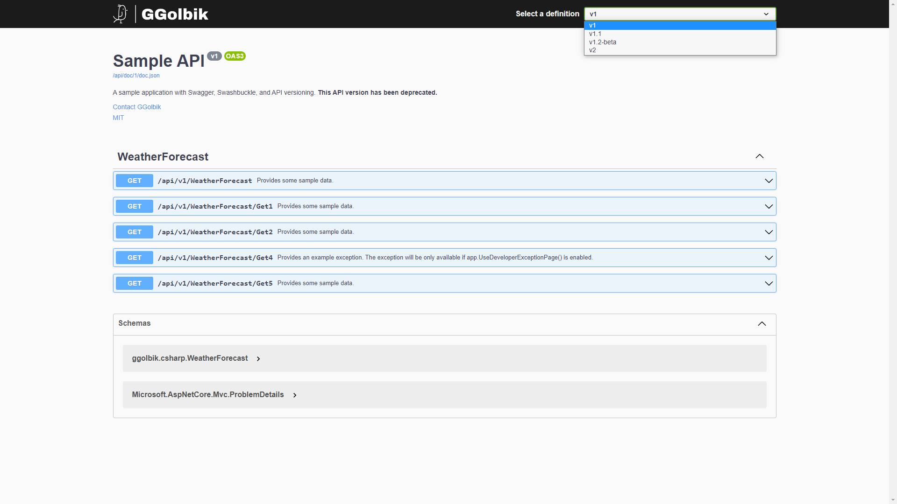

# Example 4 - ASP.NET Web-API application with versionized API, OpenAPI Swagger documentation and localization

# Table of Contents

* [Create](#create)
* [Project Settings](#project-settings)
* [API Versioning](#api-versioning)
  * [Add NuGet Packages](#add-nuget-packages)
  * [URL Path](#url-path)
    * [Map to Version](#map-to-version)
  * [Lowercase Routing](#lowercase-routing)
  * [Alternatives](#alternatives)
* [Swagger](#swagger)
  * [Add NuGet Packages](#add-nuget-packages-1)
  * [API Documentation](#api-documentation)
    * [HTTP Response Type](#http-response-type)
  * [Swagger Path](#swagger-path)
  * [Disable Submit Buttons](#disable-submit-buttons)
  * [Swagger Description](#swagger-description)
  * [Doc Generation](#doc-generation)
  * [Authorization](#authorization)
  * [Lowercase Routing](#lowercase-routing-1)
  * [Custom Logo](#custom-logo)
* [Localization](#localization)
* [Build](#build)

# Create

Create a new webapi application project:
~~~
dotnet new webapi --no-https --framework net6.0 --name example-4 --output ./src
~~~

# Project Settings

Setting the [`MSBUildProjectExtensionsPath`](https://docs.microsoft.com/en-us/nuget/reference/msbuild-targets), `BaseOutputPath` (`bin`) and `BaseIntermediateOutputPath` (`obj`) properties in the [`Directory.Build.Props`](https://docs.microsoft.com/en-us/visualstudio/msbuild/customize-your-build?view=vs-2019) file, which is located in the root directory of your solution.
~~~xml
<Project>
  <PropertyGroup>
    <MSBUildProjectExtensionsPath>$(MSBuildProjectDirectory)\..\build\$(MSBuildProjectName)\obj\</MSBUildProjectExtensionsPath>
    <BaseOutputPath>$(MSBuildProjectDirectory)\..\build\$(MSBuildProjectName)\bin\</BaseOutputPath>
    <BaseIntermediateOutputPath>$(MSBuildProjectDirectory)\..\build\$(MSBuildProjectName)\obj\</BaseIntermediateOutputPath>
  </PropertyGroup>
</Project>
~~~

# API Versioning

The API versioning extensions define simple metadata attributes and conventions that you use to describe which API versions are implemented by your services. You don't need to learn any new routing concepts or change the way you implement your services in ASP.NET today. The [wiki](https://github.com/Microsoft/aspnet-api-versioning/wiki) provides more information.

## Add NuGet Packages

Add [Microsoft.AspNetCore.Mvc.Versioning.ApiExplorer](https://www.nuget.org/packages/Microsoft.AspNetCore.Mvc.Versioning.ApiExplorer)

~~~
dotnet add package Microsoft.AspNetCore.Mvc.Versioning.ApiExplorer
~~~

Add [API Versioning](https://github.com/dotnet/aspnet-api-versioning/wiki) to the project
~~~C#
services.AddApiVersioning(options =>
{
    // Advertise the API versions supported for the particular endpoint
    options.ReportApiVersions = true;
    // Specify the default API Version
    options.DefaultApiVersion = new Microsoft.AspNetCore.Mvc.ApiVersion(1, 0);
    // If the client hasn't specified the API version in the request, use the default API version number 
    options.AssumeDefaultVersionWhenUnspecified = true;
});
~~~

## URL Path

Add the attribute `ApiVersion` and update `Route` attribute of controller or methods. The method is than available at 
- http://localhost/api/v1/weatherforecast.

You can define different version format strings (see [wiki](https://github.com/dotnet/aspnet-api-versioning/wiki/Version-Format#custom-api-version-format-strings) and [ApiVersion Pattern](https://github.com/dotnet/aspnet-api-versioning/blob/master/src/Common/ApiVersion.cs#L27) `^(\d{4}-\d{2}-\d{2})?\.?(\d{0,9})\.?(\d{0,9})\.?-?(.*)$`).
~~~C#
[ApiController]
[ApiVersion("1", Deprecated = true)]
[ApiVersion("1.1")]
[ApiVersion("1.2-beta")]
[ApiVersion("2")]
[Route("api/v{version:apiVersion}/[controller]")]
public class WeatherForecastController : ControllerBase
~~~

### Map to Version

There's another important attribute named `MapToApiVersion`. You can use it to map an action/method to a specific version. The following code snippet shows how this can be accomplished.

~~~C#
[Route("api/v{version:apiVersion}/[controller]")]
[ApiController]
[ApiVersion("1.0")]
[ApiVersion("1.1")]
[ApiVersion("2.0")]
public class DefaultController : ControllerBase
{
  string[] authors = new string[]
  { "Joydip Kanjilal", "Steve Smith", "Stephen Jones" };
  [HttpGet]
  public IEnumerable<string> Get()
  {
      return authors;
  }

  [HttpGet("{id}")]
  [MapToApiVersion("2.0")]
  public string Get(int id)
  {
     return authors[id];
  }
}
~~~

## Lowercase Routing

(optional) enforce lowercase routing as default route.

~~~C#
services.AddRouting(options => options.LowercaseUrls = true);
~~~

or

~~~C#
builder.Services.Configure<RouteOptions>(options => options.LowercaseUrls = true);
~~~

## Alternatives

There are alternative behaviors how to provide the API version
[wiki/API-Version-Reader](https://github.com/dotnet/aspnet-api-versioning/wiki/API-Version-Reader)
- URL Query String (QueryStringApiVersionReader): `https://...?v=2.0`
- Extended Header (HeaderApiVersionReader): `X-Api-Version`
- Media Type which can be set in `Content-Type` and `Accept` header (MediaTypeApiVersionReader): `application/json;v=2.0`

# Swagger

## Add NuGet Packages

Add [Swashbuckle](https://github.com/domaindrivendev/Swashbuckle.AspNetCore)
~~~
dotnet add package Swashbuckle.AspNetCore
~~~

Next, add the ApiExplorer service to the collection. You must set `SubstituteApiVersionInUrl` value to true, so that the placeholder `{version:apiVersion}` in the routes is automatically replaced by swagger. Otherwise the user has to enter the value manually.

~~~C
builder.Services.AddVersionedApiExplorer(setup =>
{
    // see https://github.com/dotnet/aspnet-api-versioning/wiki/Version-Format#custom-api-version-format-strings for more info about the format.
    // this option is only necessary when versioning by url segment.
    //setup.GroupNameFormat = "'v'VVV"; // the specified format code will format the version as "'v'major[.minor][-status]"

    setup.SubstituteApiVersionInUrl = true;
});
~~~

Create a new `ConfigureSwaggerOptions` class which is used to configure swagger to provide a page for each API version.

~~~C#
using System.Reflection;
using Microsoft.AspNetCore.Mvc.ApiExplorer;
using Microsoft.Extensions.Options;
using Microsoft.OpenApi.Models;
using Swashbuckle.AspNetCore.SwaggerGen;

namespace ggolbik.csharp.swagger
{

  /// 

  /// Configures the Swagger generation options.
  /// 

  /// <remarks>This allows API versioning to define a Swagger document per API version after the
  /// <see cref="IApiVersionDescriptionProvider"/> service has been resolved from the service container.</remarks>
  public class ConfigureSwaggerOptions : IConfigureOptions<SwaggerGenOptions>
  {
    readonly IApiVersionDescriptionProvider provider;

    /// 

    /// Initializes a new instance of the <see cref="ConfigureSwaggerOptions"/> class.
    /// 

    /// <param name="provider">The <see cref="IApiVersionDescriptionProvider">provider</see> used to generate Swagger documents.</param>
    public ConfigureSwaggerOptions(IApiVersionDescriptionProvider provider) => this.provider = provider;

    public void Configure(SwaggerGenOptions options)
    {
      // add a swagger document for each discovered API version
      // note: you might choose to skip or document deprecated API versions differently
      foreach (var description in provider.ApiVersionDescriptions)
      {
        options.SwaggerDoc(description.GroupName, CreateInfoForApiVersion(description));
      }
    }

    private static OpenApiInfo CreateInfoForApiVersion(ApiVersionDescription description)
    {
      var info = new OpenApiInfo()
      {
        Title = "Sample API",
        Version = description.ApiVersion.ToString(),
        Description = "A sample application with Swagger, Swashbuckle, and API versioning.",
        Contact = new OpenApiContact() { Name = "GGolbik", Email = "support@ggolbik.de" },
        License = new OpenApiLicense() { Name = "MIT", Url = new Uri("https://opensource.org/licenses/MIT") }
      };

      if (description.IsDeprecated)
      {
        info.Description += " <b>This API version has been deprecated.</b>";
      }

      return info;
    }
  }
}
~~~

Add the configuration class to the services:
~~~C#
builder.Services.AddTransient<IConfigureOptions<SwaggerGenOptions>, ConfigureSwaggerOptions>();
~~~

Configure the UI documentation:
~~~C#
app.UseSwaggerUI(options =>
{
    // see https://swagger.io/docs/open-source-tools/swagger-ui/usage/configuration/ for more info about the UI configuration.
    var provider = app.Services.GetRequiredService<IApiVersionDescriptionProvider>();
    foreach (var desc in provider.ApiVersionDescriptions)
    {
        // define the endpoints for the different API routes.
        options.SwaggerEndpoint($"/swagger/{desc.GroupName}/swagger.json", desc.ApiVersion.ToString());
        // Define whether the schemas of the API models should be shown. The value of -1 will hide the schemas.
        options.DefaultModelsExpandDepth(0);
        // Define whether the API groups should be expanded by default
        options.DocExpansion(Swashbuckle.AspNetCore.SwaggerUI.DocExpansion.List);
    }
});
~~~

## API Documentation

We need to add some additional entries to provide the API documentation (`summary`)

~~~C#
public class ConfigureSwaggerOptions : IConfigureOptions<SwaggerGenOptions>
{
    ...
    public void Configure(SwaggerGenOptions options)
    {
        ...
        // Set the comments path for the Swagger JSON and UI.
        var xmlFile = $"{Assembly.GetExecutingAssembly().GetName().Name}.xml";
        var xmlPath = Path.Combine(AppContext.BaseDirectory, xmlFile);
        options.IncludeXmlComments(xmlPath);
    }
    ...
}
~~~

Add entry to `*.csproj` file to generate doc.
~~~C#
<PropertyGroup>
  <GenerateDocumentationFile>true</GenerateDocumentationFile>
</PropertyGroup>
~~~

You can ignore missing documentation warningns by adding following entry to *.csproj file.
~~~C#
<PropertyGroup>
  <NoWarn>$(NoWarn);1591</NoWarn>
</PropertyGroup>
~~~

### HTTP Response Type

You can return a custom result with `ActionResult<T>`:
~~~C#
[HttpGet]
[Route("Get5")]
public ActionResult<IEnumerable<WeatherForecast>> Get5()
{
  return StatusCode(StatusCodes.Status200OK,
    Enumerable.Range(1, 5).Select(index => new WeatherForecast
    {
      Date = DateTime.Now.AddDays(index),
      TemperatureC = Random.Shared.Next(-20, 55),
      Summary = Summaries[Random.Shared.Next(Summaries.Length)]
    }).ToArray()
  );
}
~~~

You can also use the built in types.
~~~C#
return Ok(/* body */);
return BadRequest(/* body */);
~~~

An alternative is to use `IActionResult` and the `ProducesResponseType` attribute:
~~~C#
/// 

/// Returns all created connection configurations.
/// 

/// <returns>The created connection configurations.</returns>
/// <response code="200">The 200 (OK) status code indicates that the request has succeeded. The payload sent in a 200 response depends on the request method.</response>
/// <response code="500">The 500 (Internal Server Error) status code indicates that the server encountered an unexpected condition that prevented it from fulfilling the request.</response>
[ProducesResponseType(typeof(IList<ConnectionConfiguration>), StatusCodes.Status200OK)]
[ProducesResponseType(typeof(ErrorResponse), StatusCodes.Status500InternalServerError)]
[HttpGet("configurations")]
public IActionResult GetConnectionConfigurations()
{
    _logger.LogTrace(MethodBase.GetCurrentMethod()?.Name);
    return Ok(this._connectionService.GetConnectionConfigurations());
}
~~~

## Swagger Path

You can define the path where swagger should be available with:
~~~C#
app.UseSwaggerUI(options =>
{
  // Access swagger at route path
  options.RoutePrefix = "api/doc";
}
~~~

## Disable Submit Buttons

~~~C#
app.UseSwaggerUI(options => {
    options.SupportedSubmitMethods(new Swashbuckle.AspNetCore.SwaggerUI.SubmitMethod[] {});
});
~~~

The great thing about the way this is set up if you can allow some actions and not others. For example, say you wanted to allow get actions but disable the rest. The following would allow for that.

~~~C#
app.UseSwaggerUI(options =>
{
    options.SupportedSubmitMethods(new Swashbuckle.AspNetCore.SwaggerUI.SubmitMethod[] { Swashbuckle.AspNetCore.SwaggerUI.SubmitMethod.Get });
});
~~~

## Swagger Description

~~~C#
app.UseSwagger(options =>
{
    options.RouteTemplate = "api/doc/{documentName}/doc.json";
});
app.UseSwaggerUI(options =>
{
    // see https://swagger.io/docs/open-source-tools/swagger-ui/usage/configuration/ for more info about the UI configuration.
    var provider = app.Services.GetRequiredService<IApiVersionDescriptionProvider>();
    foreach (var desc in provider.ApiVersionDescriptions)
    {
        // specifying the Swagger JSON endpoint.
        // define the endpoints for the different API routes.
        options.SwaggerEndpoint($"/api/doc/{desc.GroupName}/doc.json", desc.ApiVersion.ToString("'v'VVV"));
        // Define whether the schemas of the API models should be shown. The value of -1 will hide the schemas.
        options.DefaultModelsExpandDepth(0);
        // Define whether the API groups should be expanded by default
        options.DocExpansion(Swashbuckle.AspNetCore.SwaggerUI.DocExpansion.List);
        // Define tab header
        options.DocumentTitle = "Example 4 API Documentation";
    }
}
~~~

## Doc Generation

~~~C#
// add service to generate swagger doc
builder.Services.AddSwaggerGen(options =>
{
    // customize type name of Schemas
    options.CustomSchemaIds(type => type.ToString());
    options.SupportNonNullableReferenceTypes();
});
~~~

## Authorization

~~~C#
// add service to generate swagger doc
builder.Services.AddSwaggerGen(options =>
{
    // add authorization
    options.AddSecurityDefinition("Bearer", new OpenApiSecurityScheme
    {
        In = ParameterLocation.Header,
        Description = "Please enter a valid token",
        Name = "Authorization",
        Type = SecuritySchemeType.Http,
        BearerFormat = "JWT",
        Scheme = "Bearer"
    });
    options.AddSecurityRequirement(new OpenApiSecurityRequirement
    {
        {
            new OpenApiSecurityScheme
            {
                Reference = new OpenApiReference
                {
                    Type=ReferenceType.SecurityScheme,
                    Id="Bearer"
                }
            },
            new string[]{}
        }
    });
});
~~~

## Lowercase Routing

~~~C#
app.UseSwagger(options =>
    // Force URL to lowercase in swagger
    options.PreSerializeFilters.Add((document, request) =>
    {
      var paths = document.Paths.ToDictionary(item => item.Key.ToLowerInvariant(), item => item.Value);
      document.Paths.Clear();
      foreach (var pathItem in paths)
      {
        document.Paths.Add(pathItem.Key, pathItem.Value);
      }
    });
}
~~~

## Custom Logo

Add `example-4/src/wwwroot/css/swagger-mycustom.css`
~~~css
img[alt="Swagger UI"] {
    display: block;
    -moz-box-sizing: border-box;
    box-sizing: border-box;
    content: url('/images/logo_white_large.png');
    max-width: 100%;
    max-height: 100%;
}
~~~

Add `example-4/src/wwwroot/js/swagger-custom.js`
~~~js
(function () { 
    window.addEventListener("load", function () {
        setTimeout(function () {

            // Section 01 - Set url link 
            var logo = document.getElementsByClassName('link');
            logo[0].href = location.href;
            logo[0].target = "_blank"; 
 
            // Section 02 - Set logo
            logo[0].children[0].alt = "GGolbik";
            logo[0].children[0].src = "/images/logo_white_large.png"; 
 
            // Section 03 - Set 32x32 favicon
            var linkIcon32 = document.createElement('link');
            linkIcon32.type = 'image/png';
            linkIcon32.rel = 'icon';
            linkIcon32.href = '/favicon-32x32.png';
            linkIcon32.sizes = '32x32';
            document.getElementsByTagName('head')[0].appendChild(linkIcon32);
 
            // Section 03 - Set 16x16 favicon
            var linkIcon16 = document.createElement('link');
            linkIcon16.type = 'image/png';
            linkIcon16.rel = 'icon';
            linkIcon16.href = '/favicon-16x16.png';
            linkIcon16.sizes = '16x16';
            document.getElementsByTagName('head')[0].appendChild(linkIcon16);  
        });
    });
})();
~~~

Inject files:
~~~C#
app.UseSwaggerUI(options =>
{
    options.InjectStylesheet("/css/swagger-mycustom.css");

    options.InjectJavascript("/js/swagger-custom.js", "text/javascript");
}
~~~

Add entry to `*.csproj` file to generate doc.
~~~xml
<ItemGroup>
  <EmbeddedResource Include="wwwroot/**/*">
    <CopyToOutputDirectory>PreserveNewest</CopyToOutputDirectory>
  </EmbeddedResource>
</ItemGroup>
~~~

~~~C#
// provide static files from the wwwroot folder
app.UseStaticFiles();
~~~

# Localization

Add [System.Text.Json](https://www.nuget.org/packages/System.Text.Json) package
~~~
dotnet add package System.Text.Json
~~~

Add a service interface for the localized strings.
~~~C#
public interface ITranslationService
{
    string GetHello();

    string GetHelloUser(string username);

}
~~~

Add a default implementation which uses the `IStringLocalizer` interface:
~~~C#
public class TranslationService : ITranslationService
{
    private IStringLocalizer<TranslationService> _localizer;

    public TranslationService(IStringLocalizer<TranslationService> localizer)
    {
        this._localizer = localizer;
    }

    public string GetHello()
    {
        return _localizer["hello"];
    }

    public string GetHelloUser(string username)
    {
        return _localizer["hellouser", username];
    }
}
~~~

Add class which represents the localized entries:
~~~C#
public class JsonLocalization
{
  public string? Key { get; set; }
  public Dictionary<string, string> LocalizedValue { get; set; } = new Dictionary<string, string>();

}
~~~

Create `IStringLocalizer` implementation which reads from a JSON file:
~~~C#
/// 

/// The logic to get the data from the JSON file
/// 

public class JsonStringLocalizer : IStringLocalizer
{
    private readonly List<JsonLocalization>? localization;

    public JsonStringLocalizer()
    {
        //read all json file
        if (localization == null)
        {
            localization = JsonSerializer.Deserialize<List<JsonLocalization>>(File.ReadAllText(Path.Combine(AppContext.BaseDirectory, "Resources", "i18n.json"))) ?? new List<JsonLocalization>();
        }
    }

    public LocalizedString this[string name]
    {
        get
        {
            var value = this.GetString(name);
            return new LocalizedString(name, value ?? name, resourceNotFound: value == null);
        }
    }

    public LocalizedString this[string name, params object[] arguments]
    {
        get
        {
            var format = this.GetString(name);
            var value = string.Format(format ?? name, arguments);
            return new LocalizedString(name, value, resourceNotFound: format == null);
        }
    }

    public IEnumerable<LocalizedString> GetAllStrings(bool includeParentCultures)
    {
        return localization?.Where(l => l.LocalizedValue.Keys.Any(lv => lv == CultureInfo.CurrentCulture.Name)).Select(l => new LocalizedString(l.Key ?? "", l.LocalizedValue[CultureInfo.CurrentCulture.Name], true)) ?? new List<LocalizedString>();
    }

    public IStringLocalizer WithCulture(CultureInfo culture)
    {
        return new JsonStringLocalizer();
    }

    private string? GetString(string name)
    {
        if (localization == null)
        {
            return null;
        }
        var query = localization.Where(l => l.LocalizedValue.Keys.Any(lv => lv == CultureInfo.CurrentCulture.Name));
        var value = query.FirstOrDefault(l => l.Key == name);
        if (value == null)
        {
            return null;
        }
        return value.LocalizedValue[CultureInfo.CurrentCulture.Name];
    }
}
~~~

Create factory for `JsonStringLocalizer`:
~~~C#
/// 

/// This is just to have access to the CultureInfo is the StringLocalizer.
/// 

public class JsonStringLocalizerFactory : IStringLocalizerFactory
{
  public IStringLocalizer Create(Type resourceSource)
  {
    return new JsonStringLocalizer();
  }

  public IStringLocalizer Create(string baseName, string location)
  {
    return new JsonStringLocalizer();
  }
}
~~~

Add services for localization:
~~~C#
builder.Services.AddSingleton<IStringLocalizerFactory, JsonStringLocalizerFactory>();
builder.Services.AddSingleton<IStringLocalizer, JsonStringLocalizer>();
builder.Services.AddLocalization(options => options.ResourcesPath = Program.ResourcesDirectory);
builder.Services.Configure<RequestLocalizationOptions>(options =>
{
    CultureInfo[] supportedCultures = new[]
    {
        new CultureInfo("en-US"),
        new CultureInfo("en"),
        new CultureInfo("de-DE"),
        new CultureInfo("de")
    };
    // State what the default culture for your application is. This will be used if no specific culture can be determined for a given request.
    // The difference between culture and uiculture is that culture affects culture-dependent functions like money, date formatting and so on, while uiculture affects what resources are loaded for the application.
    options.DefaultRequestCulture = new RequestCulture(culture: "en-US", uiCulture: "en-US");

    // You must explicitly state which cultures your application supports.
    // These are the cultures the app supports for formatting numbers, dates, etc.
    options.SupportedCultures = supportedCultures;

    // These are the cultures the app supports for UI strings, i.e. we have localized resources for.
    options.SupportedUICultures = supportedCultures;

    // You can change which providers are configured to determine the culture for requests, or even add a custom
    // provider with your own logic. The providers will be asked in order to provide a culture for each request,
    // and the first to provide a non-null result that is in the configured supported cultures list will be used.
    // By default, the following built-in providers are configured:
    // - QueryStringRequestCultureProvider, sets culture via "culture" and "ui-culture" query string values, useful for testing
    // - CookieRequestCultureProvider, sets culture via "ASPNET_CULTURE" cookie
    // - AcceptLanguageHeaderRequestCultureProvider, sets culture via the "Accept-Language" request header
    options.RequestCultureProviders.Insert(0, new AcceptLanguageHeaderRequestCultureProvider());
});
builder.Services.AddSingleton<ITranslationService, TranslationService>();
~~~

Add middleware for HTTP request localization:
~~~C#
//  UseRequestLocalization must appear before any middleware that might check the request culture.
var localizationOptions = app.Services.GetRequiredService<IOptions<RequestLocalizationOptions>>();
app.UseRequestLocalization(localizationOptions.Value);
~~~

Use the ITranslationService in a controller:
~~~C#
private readonly ITranslationService _translationService;

public WeatherForecastController(ITranslationService translationService)
{
  _translationService = translationService;
}
~~~

~~~C#
/// 

/// Provides some localized string
/// 

/// <returns>Sample Data</returns>
[Produces("application/json", "application/xml")]
[HttpGet]
[Route("Get6")]
public string Get6(string? username = null)
{
  if(username == null) {
    return _translationService.GetHello();
  } else {
    return _translationService.GetHelloUser(username);
  }
}
~~~

# Build

You can build the project with the `build.sh` or with the `build-docker.sh` script.

You can access the API at the below URLs:

- `http://<host>/api/doc`
- `http://<host>/api/v1/WeatherForecast/Get1`
- `http://<host>/api/v1/weatherforecast/get1`